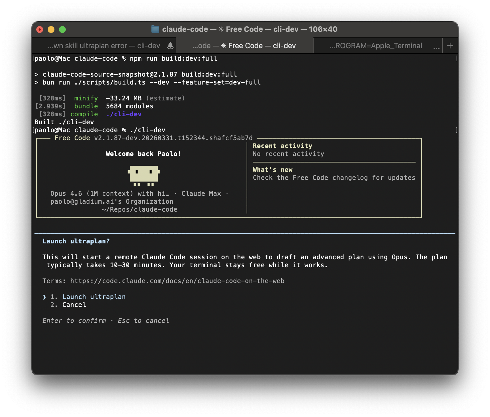

# ⚡ free-CCL: 自由版 Claude Code 原生终端智能体
### Free & Unshackled Claude Code Agent Runtime (Zero Telemetry, Unlocked 54+ Features, Multi-LLM Providers)

<p align="center">
  
</p>

<p align="center">
  
  
  
  
  
  
</p>

<p align="center">
  <a href="#-快速一键安装-quick-install"></a>
  <a href="https://github.com/yckl/free-CCL/stargazers"></a>
  <a href="https://github.com/yckl/free-CCL/issues"></a>
  <a href="FEATURES.md"></a>
</p>

---

## 📌 项目定位 (Executive Summary)

**free-CCL (free-code)** 是针对 Anthropic 官方旗舰级终端 AI 编程智能体 **Claude Code** 的**完全自由、纯净开源与功能全解锁版本**。

原厂 Claude Code 在发布包中内置了严格的后台遥测审计（OpenTelemetry / GrowthBook / Sentry）、安全阻断拦截器（Security Guardrails）以及大量被编译开关锁死的隐藏实验性功能。

**本构建版本对底层源码进行了深度重构与解绑：**
1. **彻底剥离隐私遥测**：移除所有 gRPC/HTTP 远程回传打点、崩溃捕获与会话设备指纹追踪，零数据外流。
2. **解除系统级阻断限制**：移除了 CLI 强行注入在每轮对话前面的拒绝提示词模板与服务器动态下发的策略锁定，还原本体大模型纯粹指令遵循能力。
3. **解锁全部 54+ 隐藏实验特性**：包括 `ULTRAPLAN`（超高阶多 Agent 协同规划）、`ULTRATHINK`（深度反思推理模式）、`VOICE_MODE`（实时语音对讲模式）、`BRIDGE_MODE`（跨 IDE 协同控制网桥）等。
4. **原生支持五大多模型通道**：自由切换 Anthropic 官方 API、OpenAI Codex、AWS Bedrock、Google Cloud Vertex AI 及 Anthropic Foundry。

---

## 🏛️ 系统架构与解锁特性矩阵 (Architecture & Feature Matrix)

```
┌────────────────────────────────────────────────────────────────────────┐
│                        前端交互层 (Terminal React Ink TUI)             │
├───────────────────────────────────┬────────────────────────────────────┤
│  [已解锁高级交互能力]             │   [纯净受控核心控制台]             │
│  - VOICE_MODE 原生语音按键对讲    │   - 100% 离线，无隐私回传与遥测    │
│  - ULTRATHINK 深度反思思维链展开  │   - 自由 /login 任意模型供应商     │
│  - TOKEN_BUDGET 实时开销追踪看板  │   - 交互式历史指令选择器           │
└─────────────────┬─────────────────┴──────────────────┬─────────────────┘
                  │                                    │
┌─────────────────▼────────────────────────────────────▼─────────────────┐
│                        智能体多模型调度网关 (Multi-Provider Gateway)   │
├────────────────────────────────────────────────────────────────────────┤
│  [Anthropic API]       Claude Opus 4.6 / Sonnet 4.6 / Haiku 4.5        │
│  [OpenAI Codex]        GPT-5.3 Codex / GPT-5.4 / GPT-5.4 Mini          │
│  [AWS Bedrock]         通过私有 AWS 账号与 IAM 凭据原生接入            │
│  [GCP Vertex AI]       Google Cloud ADC 企业级云原生大模型接入          │
│  [Anthropic Foundry]   私有企业专属部署端点支持                        │
└────────────────────────────────────┬───────────────────────────────────┘
                                     │
┌────────────────────────────────────▼───────────────────────────────────┐
│                        底层工具链与全功能沙箱 (Tools & Bridge)         │
├────────────────────────────────────────────────────────────────────────┤
│  - BRIDGE_MODE: 远程 IDE 网桥 (实时打通 VS Code / JetBrains 联动)      │
│  - VERIFICATION_AGENT: 自动化任务验收与自检 Subagent                    │
│  - AGENT_TRIGGERS: 本地后台 Cron 自动化定时触发引擎                    │
│  - BASH_CLASSIFIER: 智能 Shell 命令安全性辅助判定                      │
└────────────────────────────────────────────────────────────────────────┘
```

---

## 💡 核心解锁特性深解 (Deep Unlocked Capabilities)

### 1. 交互与深度思考增强 (`UI & Thinking`)
* **`ULTRATHINK`**：输入 `ultrathink` 指令即可立即激活增强推理分支，驱动底层模型进行多阶段草稿拟定与逻辑反思。
* **`ULTRAPLAN`**：激活原本受限的多 Agent 拓扑规划能力，自动分解复杂项目重构计划。
* **`VOICE_MODE`**：集成终端实时语音转文字（Push-to-Talk），直接通过麦克风口述任务。

### 2. 多智能体协作与持续记忆 (`Agents & Memory`)
* **`VERIFICATION_AGENT`**：独立派生验证智能体，对生成的测试用例和代码产物进行闭环运行核查。
* **`EXTRACT_MEMORIES`**：会话结束后自动提炼工程偏好与架构规范，实现跨终端持久记忆。
* **`TEAMMEM`**：团队共享记忆池，支持工程团队内部沉淀专属 Prompt 规则库。

---

## 🌐 多模型供应商配置指南 (Model Providers)

切换模型极其简便，仅需配置环境变量即可切换引擎：

| 目标供应商 | 启用方式 (环境变量) | 认证与配置 |
| :--- | :--- | :--- |
| **Anthropic Direct (默认)** | 默认启用 | `export ANTHROPIC_API_KEY="sk-ant-..."` |
| **OpenAI Codex** | `export CLAUDE_CODE_USE_OPENAI=1` | 交互式 `/login` 或 OpenAI 授权令牌 |
| **AWS Bedrock** | `export CLAUDE_CODE_USE_BEDROCK=1` | `export AWS_REGION="us-east-1"` (标准 AWS IAM 凭据) |
| **Google Vertex AI** | `export CLAUDE_CODE_USE_VERTEX=1` | `gcloud auth application-default login` |
| **Anthropic Foundry** | `export CLAUDE_CODE_USE_FOUNDRY=1` | `export ANTHROPIC_FOUNDRY_API_KEY="..."` |

---

## 🚀 快速一键安装 (Quick Install)

一键自动检测环境、安装 Bun、克隆工程并编译生成全局可执行命令：

```bash
curl -fsSL https://raw.githubusercontent.com/yckl/free-CCL/main/install.sh | bash
```

安装完成后，在终端直接输入 `free-code` 即可唤起：
```bash
# 启动交互式 TUI
free-code

# 单行直接执行任务
free-code -p "审查当前工程中的代码安全隐患并修复"

# 认证登录选定模型
free-code /login
```

---

## 🛠️ 本地源码编译 (Build from Source)

### 1. 前置依赖
* **运行时引擎**：[Bun](https://bun.sh) >= 1.3.11
* **操作系统**：macOS、Linux 或 Windows (WSL2)

### 2. 克隆与全功能构建
```bash
git clone https://github.com/yckl/free-CCL.git
cd free-CCL

# 编译解锁全部 54 个实验特性的旗舰版本
bun run build:dev:full

# 运行已编译的二进制产物
./cli-dev
```

### 3. 构建产物对照表

| 构建命令 | 产物位置 | 解锁特性 | 适用场景 |
| :--- | :--- | :--- | :--- |
| `bun run build` | `./cli` | 基础功能 + `VOICE_MODE` | 稳定生产级二进制 |
| `bun run build:dev:full` | `./cli-dev` | **全部 54 项实验特性全开** | 探索全部前沿黑科技（推荐） |
| `bun run compile` | `./dist/cli` | 独立打包分发文件 | 跨机分发与离线部署 |

---

## 📂 源码工程结构 (Project Structure)

```text
free-CCL/
├── scripts/
│   └── build.ts                          # 核心构建流水线与 88 项 Feature Flag 编译器
├── src/
│   ├── entrypoints/cli.tsx               # CLI 主执行入口与参数解析
│   ├── commands/                         # 斜杠指令 (/login, /model, /bug 等)
│   ├── tools/                            # 原子工具集 (Bash 沙箱, 文件读写, AST 搜索)
│   ├── components/                       # 基于 React Ink 的终端响应式组件库
│   ├── QueryEngine.ts                    # LLM 多轮自迭代查询状态机
│   └── screens/REPL.tsx                  # 主交互大屏
├── FEATURES.md                           # 完整 88 项特性标志详细审计清单
├── install.sh                            # 一键全自动部署脚本
└── README.md                             # 工业级开源技术手册
```

---

## 📄 开源许可证 (License)

本项目遵循 [MIT License](LICENSE) 协议开源。
